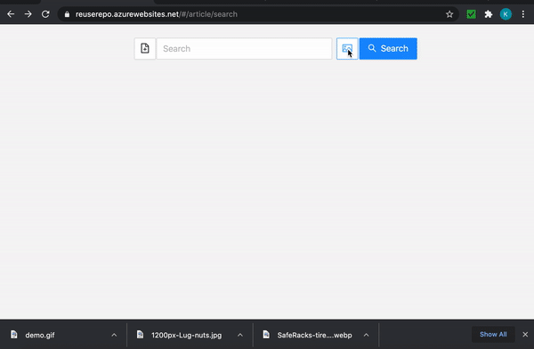
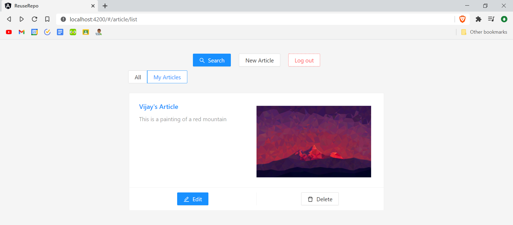
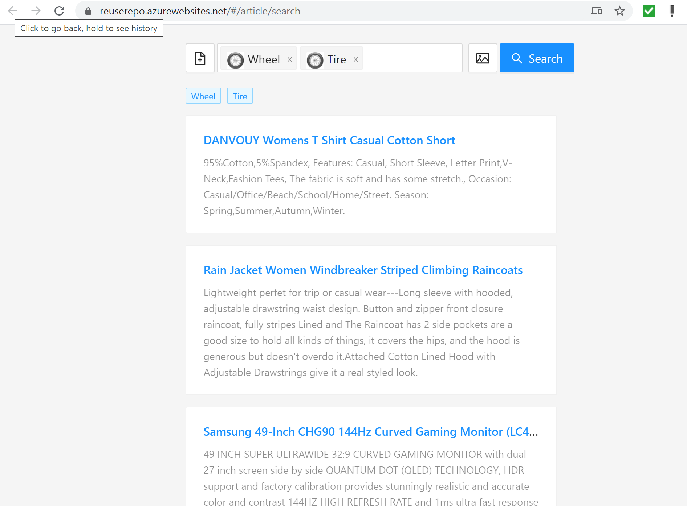
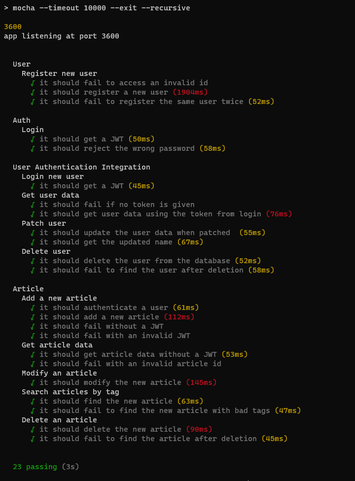

# ReuseRepo

 Website: [ReuseRepo](https://reuserepo.azurewebsites.net/#/article/search)  
 Team: Arsal, Rayhaan, Vijay  
 Repo: [https://github.com/ArsalKhan1/ReuseRepo](https://github.com/ArsalKhan1/ReuseRepo)  
  
 We created a community website that helps people find ideas to reuse items that otherwise would go in the garbage or recycling.
 
    

# Design
The application uses 3 tiers.
    Angular based Front End,
    Node and Express based APIs, and 
    MongoDB
   
## 1. UI (Angular + Material Design Skin)
   The application uses an out of the box Angular and Material Design skin. We used angular cli ng commands to spawn the project. See details in [/UI-Angular/README.md](UI-Angular/README.md)
   
   [VP] Added thumbnails for articles that have images
    

## 2. API (NodeJS and ExpressJS)
   Created a shell API using NodeJS by following this [example](https://www.toptal.com/nodejs/secure-rest-api-in-nodejs)  
   
    Use following commands to run it  
        - npm install  
        - npm start  
    This will start the API server on port 3600. 
 
## 3. Datastore (Cosmos DB with Mongos API)
   Created an out of the box MongoDB on azure using portal.azure.com

# Hosting
   [AK] Signed up for azure free hosting acount with $200 credit.  
   [AK] Built angular for deployment  
        ng build --prod  
        Deployed to [https://reuserepo.azurewebsites.net/#/article/search](https://reuserepo.azurewebsites.net/#/article/search)  
        Hosted the site following this [post](https://www.c-sharpcorner.com/article/easily-deploy-angular-app-to-azure-from-visual-studio-code/)         

        Hosted latest version with search and list functionality 
    
   
   
# Testing
   [RT] Set up Mocha and Chai to perform unit test on the node.js API.  
   [RT] Wrote unit tests and integration tests for the user and authentication features of the API.  
        Run `npm test` in /API-NodeJS to run the tests and get output in the terminal.  
   
