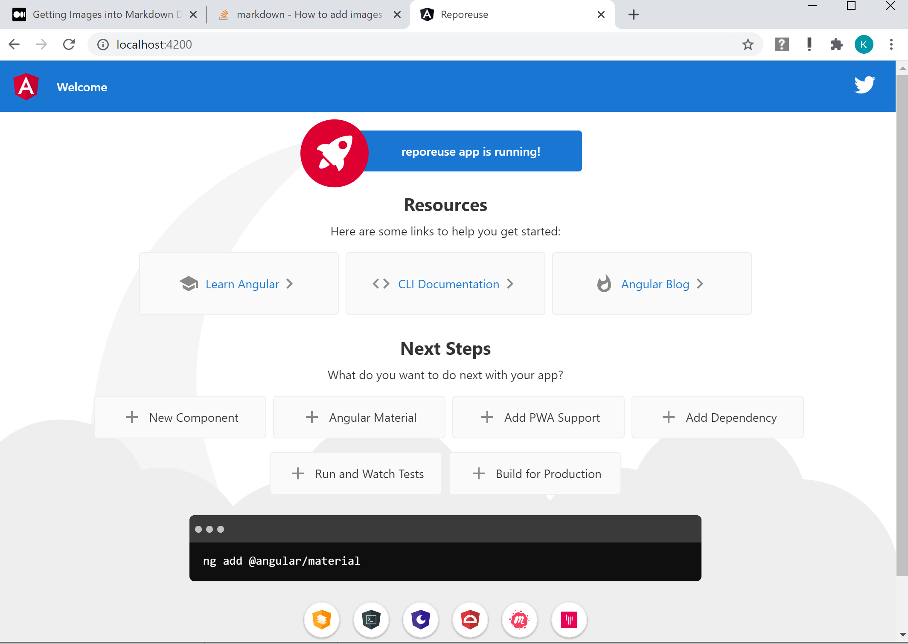

# ReuseRepo - To be Edited

 Title: [ReuseRepo](https://reuserepo.azurewebsites.net/)  
 Team: Arsal, Reehan, Vijay  
 Repo: [https://github.com/ArsalKhan1/ReuseRepo](https://github.com/ArsalKhan1/ReuseRepo)  
  
 A blurb about the project, team, technology and aspiration  

# Progress Log 

For now I am just putting some logs here with links that I used. will fix them later

## 1. Design 
    [AK] TBD  

## 2. Project Setup
   [AK] 1. Started using data stucture project and cleaned it up for reuserepo  

   
## 3. UI Setup
   [AK] Created angular baseline project 
       - ng new ReuseRepo  
       - npm install  
       - ng serve  
       - http://localhost:4200/  
        
        
      
## 4. API Setup
    [AK] TBD - Still figuring out how to build APIs.
   
## 5. Hosting Setup
   [AK] Signed up for azure free hosting acount with $100 credit.  
   [AK] Built angular for deployment  
        ng build --prod  
        This created a build under [UI-Angular](UI-Angular/dist/reuserepo)  
        Hosted the site following this [post](https://www.c-sharpcorner.com/article/easily-deploy-angular-app-to-azure-from-visual-studio-code/)  
                

   
